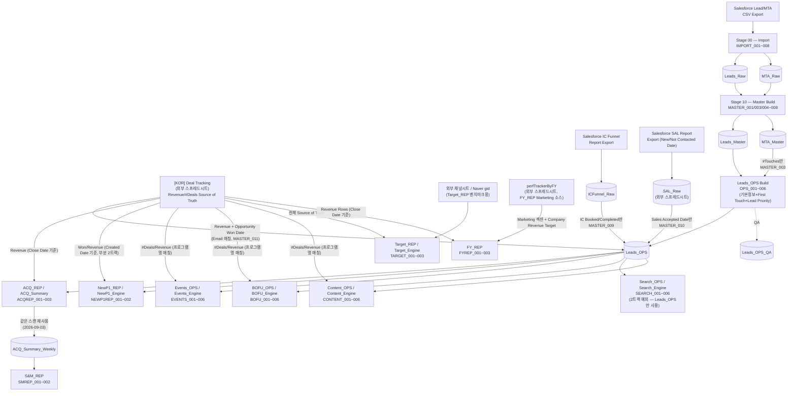

# Roadmap

이 프로젝트의 장기 방향/우선순위를 담는 문서. `docs/OpenItems.md`(당장의 미해결 버그/설계
공백)와 달리, 여기는 "다음에 무엇을 할 것인가"에 대한 의도적 계획을 담는다. 완료되는 문서가
아니라 계속 갱신되는 문서라는 점에서 `docs/exec-plans/`(태스크 단위, 완료 시 archive)와 역할이
다르다 — 자세한 구분은 `docs/ExecPlanConvention.md` 참고.

2026-07-30 신설.

## 현재 아키텍처 (2026-09-03 기준)

`CORE_001_Config.js`/`OPS_001_Config.js`/`EVENTS_001_Config.js`/`BOFU_001_Config.js`/
`SEARCH_001_Config.js`/`CONTENT_001_Config.js`/`SMREP_001_Report.js`/`FYREP_001_Engine.js`의
실제 `SHEET`/`ENGINE` 상수를 확인해 그린 현재 파이프라인(2026-08-09 파일명 신규 네이밍
컨벤션 반영, 2026-09-02 Leads_OPS 필드 소유권 전면 재편 + SAL 외부시트 분리 + Revenue
역싱크 반영, 2026-09-03 S&M_REP 성능 개선 반영 — 이전 버전은 git 이력 참고).
`docs/Architecture.md`의 Stage 정의(00 Import → 10 Master Build → 20 Reporting)를 실제
시트명/파일명과 함께 구체화한 것.

**읽는 법**
- 리드~세일즈 액티비티(New P1/SAL/IC Booked 등)는 전부 `Leads_OPS` 기준 — 이 화살표는 위 다이어그램에 전부 생략(모든 리포트가 공통으로 `Leads_OPS`를 읽음).
- Revenue/#Deals가 들어가는 지표만 Deal Tracker(외부 시트)를 2번째 소스로 추가 참조 — "2트랙 아키텍처"([[project_two_track_revenue_deal_tracker]] 참고).
- **Search_OPS/Search_Engine만 예외** — raw UTM 그레인 문제로 아직 Deal Tracker 전환 대상에서 빠져있음(`docs/OpenItems.md` #5 참고), 여전히 Leads_OPS의 `Opportunity Won Date`/`Revenue`를 그대로 씀.
- **Leads_OPS 필드 소유권은 리포트별로 분리돼 있음(2026-09-02 전면 재편)** — New Leads(Leads_Master)/MTA(#Touches만)/SAL(SAL_Raw 외부시트)/IC Funnel(IC Booked/Completed만)/Revenue(Deal Tracker 역싱크) 각자 자기 필드만 씀, 위 다이어그램에 그대로 반영. 상세: `docs/OperationsLayer.md` "Field Ownership 전면 재편" 섹션.
- **S&M_REP은 Leads_OPS/MTA_Master를 직접 스캔하지 않음(2026-09-03부터)** — ACQ Engine이 이미 하는 스캔에 얹은 주 단위 캐시(`ACQ_Summary_Weekly`)만 읽음(실측 119.8s → 4.0s, `docs/OpenItems.md` #41 참고). New P1 정의는 ACQ_REP과 완전히 동일(Leads_OPS의 Priority Override/다운그레이드 가드 포함) — 소스가 갈라지지 않음.
- FY_REP은 Leads_OPS(ACQ/Pipeline 섹션) + Deal Tracker(Revenue 섹션) + perfTrackerByFY(Marketing 섹션 + Company Revenue Target) 3개 소스를 합쳐 계산.
- QA/유지보수 유틸리티(`OPS_006_QA.js`, `TEMPQA_*.js`, `MAINT_001_WorkbookMaintenance.js`, `RESET_001_ResetRawMaster.js`)는 메인 데이터 흐름이 아니라 검증/복구 도구라 다이어그램에서 제외.

## End Goal (2026-07-30 확정)

이 프로젝트의 현 시점 End Goal — 아래 Phase 1 → Phase 2 순서로 착수(Phase 2는 Phase 1 완료 후).

### Phase 1 — 외부 캠페인 지출 데이터 통합 (CPNP1 실적 계산 기반)

**배경**: 현재 파이프라인은 리드 정보만 있고 캠페인 자체의 지출(spend) 데이터가 없어 CPNP1(Cost
Per New P1)을 실측할 수 없다 — `Target_REP`은 지금 목표(target)만 top-down으로 역산할 뿐, 실제
집행된 광고비 대비 CPNP1 실적과 대조가 안 된다.

**⚠️ 원래 계획(아래 "(폐기됨) 원래 소스" 참고) 폐기 — 2026-07-30 방향 전환**: 착수 착수하며
외부 Google Sheet(`Monthly{채널}` 탭들)를 소스로 쓰려 했으나, 이 탭들이 **채널/계정 단위 월
집계**(캠페인명 컬럼 없음)라는 게 확인됨 — 사용자 확인: "채널 하나를 여러 세그먼트가 공유해서
쓴다"(예: Meta 광고 하나가 Seminar/Webinar/BOFU 홍보에 동시에 쓰임). 채널 단위 합계로는 세그먼트별
Spent를 분리할 수 없어(캠페인 단위 지출 데이터 자체가 지금 없음, 사용자 확인) 이 소스로는 Phase 1
목표(세그먼트별 CPNP1 실측)를 달성 불가 — 폐기.

**신규 방향(2026-07-30 확정)**: 각 광고 플랫폼(Meta/Naver Search Ads/Google Ads 등)에서
**캠페인 단위** 리포트를 직접 주기적으로 export해서 가져온다. 이 프로젝트의 기존 Leads_Raw/
MTA_Raw 패턴(원본 불변 append-only, 매번 전체가 아니라 겹치는 구간만 export해도 Incremental
Master Build가 중복 제거하며 병합)을 그대로 재사용 — 캠페인 지출도 동일한 문제(매번 export가
전체 기간이 아님)를 겪으므로 검증된 해법을 재사용하는 것.

**아키텍처(사용자 확정, 2026-07-30)**: **별도 Google Sheet + 같은 Apps Script 프로젝트**
(crimson-lead-tracker) — 지금 이 메인 스프레드시트가 이미 무거워서 데이터를 안 얹고, `Deal
Tracker`처럼 `SpreadsheetApp.openById()`로 별도 시트를 읽고/쓴다(코드는 이 레포에 그대로 둠,
완전히 새 스프레드시트+새 바운드 스크립트 프로젝트는 아님).

**미정(착수 시 확인 필요, 임의로 처리하지 말 것)**:
- 새 캠페인 지출 스프레드시트가 이미 존재하는지, 만들어야 하는지(ID 필요)
- 각 광고 플랫폼(Meta/Naver SA/Google Ads 등) export의 실제 컬럼 구조(캠페인명/날짜/Spent 등
  필드명) — Leads/MTA Transformer처럼 플랫폼별 파싱 로직이 필요할 것으로 예상
- 캠페인명 → Business Segment 매핑 로직 — `getBusinessSegment()`(Salesforce UTM 기준)과 같은
  방식이 광고 플랫폼 캠페인명에도 통할지, 별도 분류 함수가 필요할지
- Raw/Master 파일 번호대(기존 00~99 넘버링과 충돌 안 하는 새 구간 필요)
- New P1(Leads_OPS 기반)과 매칭할 그레인 — 월 단위는 확정적이나 세그먼트 단위 매칭 방법은 세그먼트
  분류 로직이 정해져야 확정 가능
- 최종적으로 Target_Engine Block 0의 수동 Spent 입력을 이 파이프라인 결과로 대체할지, 별도
  참고 지표로만 둘지

**(폐기됨) 원래 소스 — 참고용 보존**: 외부 Google Sheet(`1QDB_9MiD6eTeNlnC8YMWXbyncSwgDOTZT-A-KItlu6A`),
`Monthly{채널}` 탭(`MonthlyMeta` gid `1546305708` 확인, `MonthlyNSA`/`MonthlyGFA` 등 존재 추정).
`MonthlyMeta` 확인된 구조: 월별(2023-01~) 1행=1개월, `allCvR/Clicks/Results/Spent/CPL/Rev/ROAS`
+ 비고(자유 텍스트), 캠페인명 컬럼 없음 — 이 구조적 한계 때문에 위와 같이 폐기됨.

### Phase 2 — Target_REP 전체 세그먼트/예산 반영 재설계

**전제조건**: Phase 1(CPNP1 실적 계산 가능) 완료 후 착수.

**배경**: 현재 `Target_REP`/`Target_Engine`은 (a) 예산(budget) 정보를 전혀 반영하지 않고 top-down
매출 목표만으로 역산하며, (b) 세그먼트가 3개 그룹(Events/Contact/Content)으로 추상화되어 있음 —
전체 Business Segment(7개) 단위가 아님.

**계획**: 예산 정보를 반영하고, 세그먼트를 3그룹 추상화가 아니라 **전체 Business Segment 단위로
분해**해서 세그먼트별로 각각 Target New P1 / Pipeline P1 / CPNP1 목표와 진행상황(실적 대조)을 볼
수 있도록 구조 변경.

## 계획 중 (End Goal과 별개)

### FY별 Sales Funnel 대시보드 — 2026-08-07 재착수, 독립 FY_REP 시트로 최종 확정

**2026-08-07 재확정**: 2026-07-30엔 "별도 리포트 대신 ACQ_REP/NewP1_REP 확장"으로 방향을
틀었으나, 사용자가 "FY24/25/26 monthly Segment/Sales Funnel 비교"를 다시 요청하면서 요구
범위가 커짐(Marketing/ACQ/Pipeline/Revenue 4개 섹션, 플랫폼별 채널 데이터까지) — 이번엔
**독립 `FY_REP` 신규 시트로 최종 확정**(기존 리포트에 끼워넣기엔 grain이 안 맞음). 상세 설계/
진행 상황은 `docs/exec-plans/active/2026-08-07-fy-rep-implementation.md` 참고.
`docs/FYReportDesign.md`(2026-07-30 superseded 처리됐던 원래 설계 검토 기록)는 이번 재착수의
배경 참고 자료로 남겨두되, 실제 구조는 새 exec-plan 기준.

아래는 2026-07-30 당시의 대안이었고, **FY_REP과 별개로 이미 구현·배포 완료됨**(대체 관계
아님 — 둘 다 살아있음, `docs/OpenItems.md` #17 참고. 단, Target_Engine이 한 번에 FY 하나만
갖는 구조적 한계 때문에 이 확장은 "현재 설정된 FY 하나"만 보여줄 수 있고 여러 FY 동시 비교는
못 함 — 그 한계를 해소하는 게 이번 FY_REP 재착수의 핵심 동기 중 하나):

- **`ACQ_REP`**: Revenue Target/Target% + New P1 Target/Target% 컬럼 추가 (달성 시 하이라이트)
- **`NewP1_REP`**: New P1 Target/Target% + Spent + CPNP1(실적) 컬럼 추가

Target 원천은 `Target_Engine`(Block C Deal Share, Block D New P1 Target)을 재사용. Pipeline
P1 Target(구 코호트 딜의 이번 FY 전환분)은 이 확장에서 제외 — 실제 클로징 여부가 불확실한
영역이라 New P1(리드 생성 카운트) 목표와 성격이 다르다는 사용자 판단(2026-07-30). 상세:
`docs/ACQReportDesign.md`/`docs/NewP1ReportDesign.md`, `docs/exec-plans/active/
2026-07-30-acq-newp1-target-columns.md`(또는 completed/로 이동됐을 수 있음).

## 진행 중 (exec-plans/active/에 대응 문서 있음)

(없음)

## 보류/재검토 대기

(없음)

## End Goal 이후 (장기, 순서 미정)

- 위 "현재 아키텍처" 플로우차트상 남아있는 빈틈을 실무자들이 실사용하면서 발견 → 채워넣는
  유지보수 + 리팩토링
- 네이밍 컨벤션 변경
- 에이전트를 활용한 QA 체계 구축
