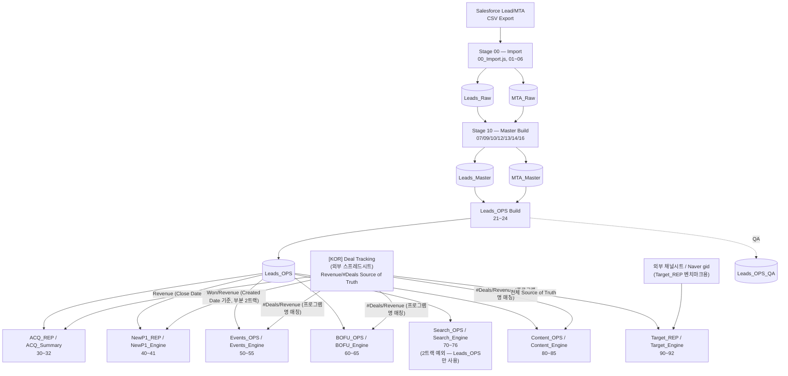

# Roadmap

이 프로젝트의 장기 방향/우선순위를 담는 문서. `docs/OpenItems.md`(당장의 미해결 버그/설계
공백)와 달리, 여기는 "다음에 무엇을 할 것인가"에 대한 의도적 계획을 담는다. 완료되는 문서가
아니라 계속 갱신되는 문서라는 점에서 `docs/exec-plans/`(태스크 단위, 완료 시 archive)와 역할이
다르다 — 자세한 구분은 `docs/ExecPlanConvention.md` 참고.

2026-07-30 신설.

## 현재 아키텍처 (2026-07-30 기준)

`00_Config.js`/`20_OPS_Config.js`/`50_Events_Config.js`/`60_BOFU_Config.js`/`70_Search_Config.js`/
`80_Content_Config.js`의 실제 `SHEET`/`ENGINE` 상수를 확인해 그린 현재 파이프라인. `docs/Architecture.md`의
Stage 정의(00 Import → 10 Master Build → 20 Reporting)를 실제 시트명/파일번호와 함께 구체화한 것.

**읽는 법**
- 리드~세일즈 액티비티(New P1/SAL/IC Booked 등)는 전부 `Leads_OPS` 기준 — 이 화살표는 위 다이어그램에 전부 생략(모든 리포트가 공통으로 `Leads_OPS`를 읽음).
- Revenue/#Deals가 들어가는 지표만 Deal Tracker(외부 시트)를 2번째 소스로 추가 참조 — "2트랙 아키텍처"([[project_two_track_revenue_deal_tracker]] 참고).
- **Search_OPS/Search_Engine만 예외** — raw UTM 그레인 문제로 아직 Deal Tracker 전환 대상에서 빠져있음(`docs/OpenItems.md` #5 참고), 여전히 Leads_OPS의 `Opportunity Won Date`/`Revenue`를 그대로 씀.
- QA/유지보수 유틸리티(`24_OPSQA.js`, `76_TempQA_SearchCatchAll.js`, `93_TempQA_DealTrackerMatch.js`, `94_TempQA_CohortMedianV.js`, `94_WorkbookMaintenance.js`, `99_ResetRawMaster.js`)는 메인 데이터 흐름이 아니라 검증/복구 도구라 다이어그램에서 제외.

## End Goal (2026-07-30 확정)

이 프로젝트의 현 시점 End Goal — 아래 Phase 1 → Phase 2 순서로 착수(Phase 2는 Phase 1 완료 후).

### Phase 1 — 외부 캠페인 지출 데이터 통합 (CPNP1 실적 계산 기반)

**배경**: 현재 파이프라인은 리드 정보만 있고 캠페인 자체의 지출(spend) 데이터가 없어 CPNP1(Cost
Per New P1)을 실측할 수 없다 — `Target_REP`은 지금 목표(target)만 top-down으로 역산할 뿐, 실제
집행된 광고비 대비 CPNP1 실적과 대조가 안 된다.

**소스**: 외부 Google Sheet(`1QDB_9MiD6eTeNlnC8YMWXbyncSwgDOTZT-A-KItlu6A`) — 채널/계정별로
`Monthly{채널}` 탭이 분리되어 있음. 확인된 탭:
- `MonthlyMeta`(gid `1546305708`) — 확인 완료
- `MonthlyNSA`(Naver Search Ads로 추정)
- `MonthlyGFA`(Google/Facebook Ads로 추정)
- 그 외 탭 존재 가능성 있음 — **착수 시 전체 탭 목록 재확인 필요**

**확인된 구조(`MonthlyMeta` 기준)**: 월별(2023-01~) 1행 = 1개월, 컬럼은 `allCvR / Clicks /
Results / Spent / CPL / Rev / ROAS` + 우측 "비고"(캠페인 메모, 자유 텍스트). **캠페인명이 별도
컬럼으로 없음** — 계정/채널 단위 월 집계이며, 다른 채널 탭도 동일 구조로 추정(착수 시 확인).

**계획**: 이 탭들의 `Spent`를 OPS 레이어로 가져와 CPNP1 계산 자료로 사용.

**미정(착수 시 확인 필요, 임의로 처리하지 말 것)**:
- 전체 탭 목록(위 3개 외에 더 있는지)
- 각 채널 탭 → Business Segment 매핑(예: `MonthlyMeta` 지출이 어느 세그먼트의 New P1과 짝지어야
  하는지 — 세그먼트 하나에 대응하는지, 여러 세그먼트에 걸쳐있는지)
- New P1(Leads_OPS 기반)과 매칭할 그레인 — 월 단위는 확정적이나 세그먼트 단위 매칭 방법은 미정
- 기존 OPS 시트(예: Target_Engine)에 컬럼 추가로 통합할지, 신규 레이어(예: `Campaign_OPS`)를 만들지

### Phase 2 — Target_REP 전체 세그먼트/예산 반영 재설계

**전제조건**: Phase 1(CPNP1 실적 계산 가능) 완료 후 착수.

**배경**: 현재 `Target_REP`/`Target_Engine`은 (a) 예산(budget) 정보를 전혀 반영하지 않고 top-down
매출 목표만으로 역산하며, (b) 세그먼트가 3개 그룹(Events/Contact/Content)으로 추상화되어 있음 —
전체 Business Segment(7개) 단위가 아님.

**계획**: 예산 정보를 반영하고, 세그먼트를 3그룹 추상화가 아니라 **전체 Business Segment 단위로
분해**해서 세그먼트별로 각각 Target New P1 / Pipeline P1 / CPNP1 목표와 진행상황(실적 대조)을 볼
수 있도록 구조 변경.

## 계획 중 (End Goal과 별개)

### FY별 Sales Funnel 대시보드

리드 → SAL → IC Booked → IC Complete → Won 등 세일스 퍼널 전 단계를 FY(Fiscal Year)별로 보는
대시보드 구축 필요(2026-07-30 사용자 확정). 상세 설계(어느 시트/데이터 기준으로 만들지, 세그먼트
분해 여부 등)는 미정 — 착수 시 별도로 확정.

## 진행 중 (exec-plans/active/에 대응 문서 있음)

(없음)

## 보류/재검토 대기

(없음)

## End Goal 이후 (장기, 순서 미정)

- 위 "현재 아키텍처" 플로우차트상 남아있는 빈틈을 실무자들이 실사용하면서 발견 → 채워넣는
  유지보수 + 리팩토링
- 네이밍 컨벤션 변경
- 에이전트를 활용한 QA 체계 구축
